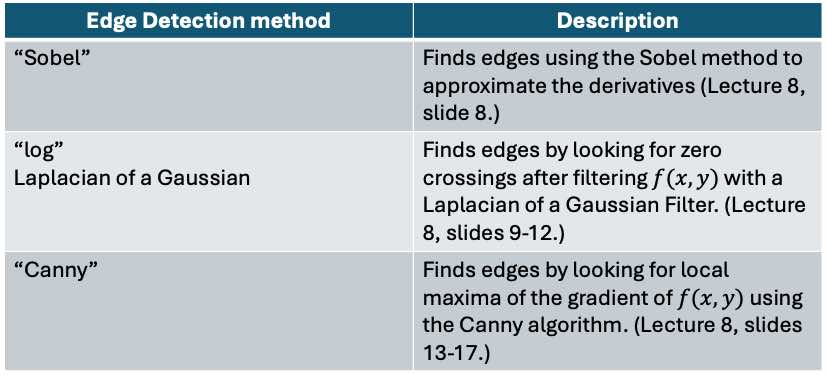

# Lab 5 - Segmentation and Feature Detection
*_Peter Cheung, version 1.0, 22 Feb 2024_*


In this laboratory session, you will explore techniques to identify features and regions in an image. As before, clone this repository to your laptop and keep your experimental logbook on your repo.  

## Task 1: Point Detection using Laplacian Filter

The file "crabpulsar.tif" contains an image of the neural star Crab Nebula, which was the remnant of the supernova SN 1054 seen on earth in the year 1054. 

The goal is to try to remove the main nebular and only highlight the surrounding stars seen in the image.

Try the following code and explain what hapens.

```
clear all
close all
f = imread('assets/crabpulsar.tif');
w = [-1 -1 -1;
     -1  8 -1;
     -1 -1 -1];
g1 = abs(imfilter(f, w));     % point detected
se = strel("disk",1);
g2 = imerode(g1, se);         % eroded
threshold = 100;
g3 = uint8((g2 >= threshold)*255); % thresholded
montage({f, g1, g2, g3});
```

## Task 2: Edge Detection 

Matlab Image Processing Toolbox provides a special function *_edge( )_* which returns an output image containing edge points.  The general format of this function is:

```
[g, t] = edge(f, 'method', parameters)
```
*_f_* is the input image.  
*_g_* is the output image.  *_t_* is an optional return value giving the threshold being used in the algorithm to produce the output.  
*_'method'_* is one of several algorithm to be used for edge detection.  The table below describes three algorithms we have covered in Lecture 8.

<p align="center">  </p>

The image file 'circuits.tif' is part of a chip micrograph for an intergrated circuit.  The image file 'brain_tumor.jpg' shows a MRI scan of a patient's brain with a tumor.

Use *_function edge( )_* and the three methods: Sobel, LoG and Canny, to extract edges from these two images.

The function *_edge_* allows the user to specify one or more threshold values with the optional input *_parameter_* to control the sensitivity to edges being detected.  The table below explains the meaning of the threshold parameters that one may use.

<p align="center">  </p>

Repeat the edge detection exercise with different threshold to get the best results you can for these two images.


```
